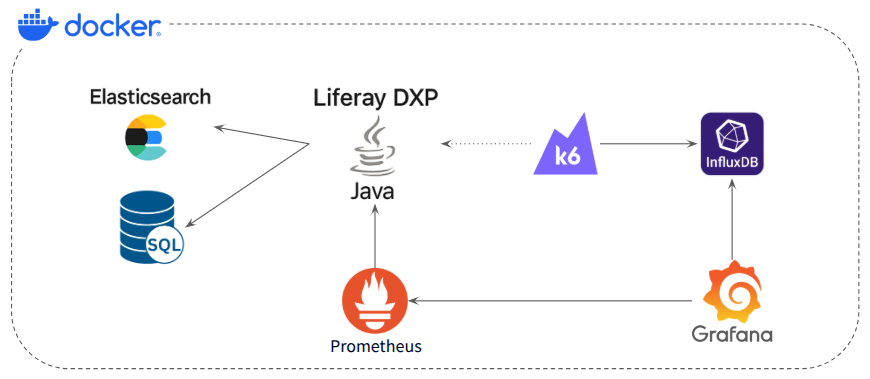

# Tuning Liferay DXP

Liferay DXP 7.4 running on docker compose.

## Requirements

* Docker and Docker Compose (CE edition)

## Architecture



## Database DUMP

The database dump is in the ```/database-dump``` folder.

## Document Library

Liferay Document Library is mapped to ```liferay-document-library/``` folder.

## Start the environment

```
docker compose up --build -d
```

## Get logs:

```
docker compose logs -f liferay
```

## Access

Access http://localhost:8080/ and login with test@liferay.com

# Load Tests

## Grafana

Access http://localhost:3000/ and login with following credentials: admin/admin

Import some dashboard from https://grafana.com/grafana/dashboards/?search=k6&dataSource=influxdb

Or you can use the two dashboards from this repo in the folder [grafana-dashboards](grafana-dashboards).

## Prometheus

Access http://localhost:9090

## InfluxDB

Check if is running executing:

```
curl -sl -I http://localhost:8086/ping
```

The response should be something like:

```
HTTP/1.1 204 No Content
Content-Type: application/json
Request-Id: daf56f37-0782-11f1-8166-662020df422a
X-Influxdb-Build: OSS
X-Influxdb-Version: v1.11.8
X-Request-Id: daf56f37-0782-11f1-8166-662020df422a
Date: Wed, 11 Feb 2026 19:50:02 GMT
```

## Execute the k6 tests

To run k6, execute the container using the script that contains the scenario that you would like to test:

For full authentication flow scenario:

```
docker compose run --rm -T k6 run /scripts/01-autentication-flow.js --tag testid=my-test-01
```

For simple load page scenario:

```
docker compose run --rm -T k6 run /scripts/02-simple-load-content-page.js --tag testid=my-test-02
```
